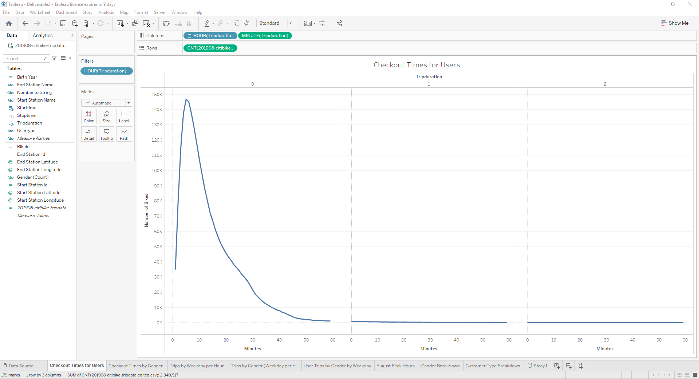
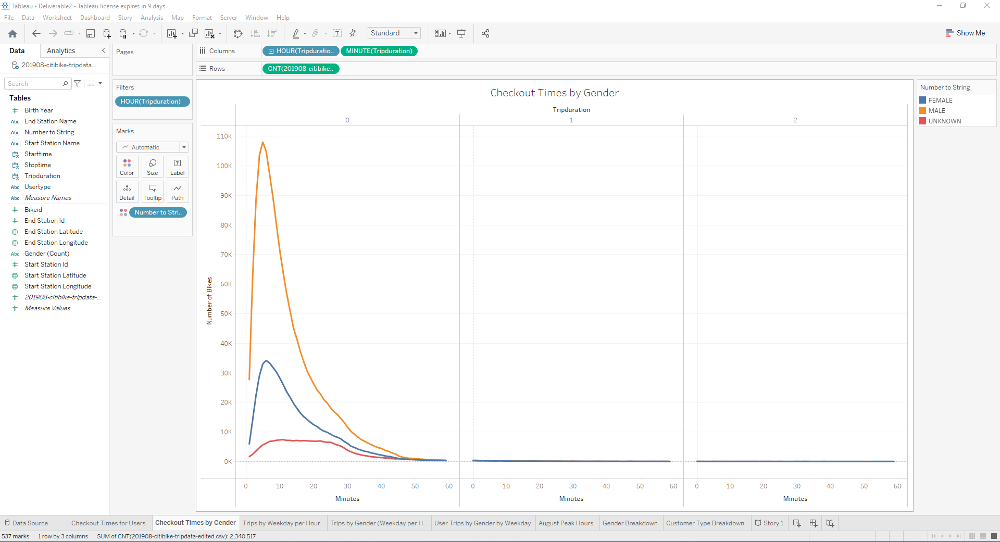
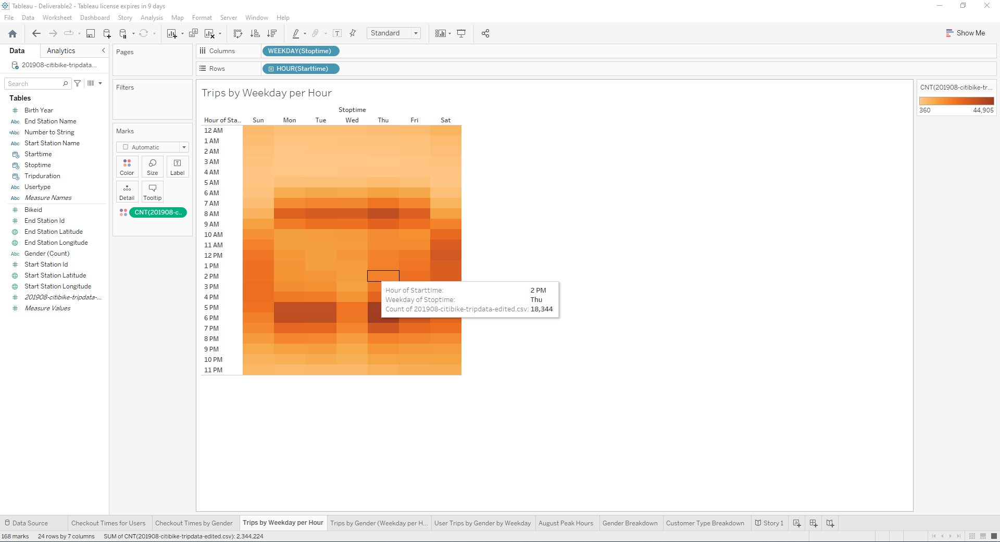
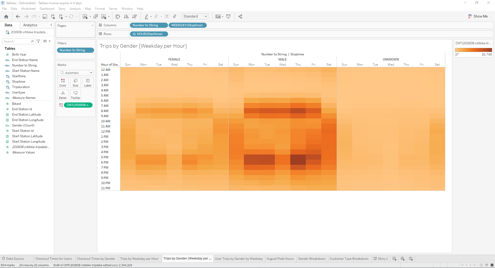
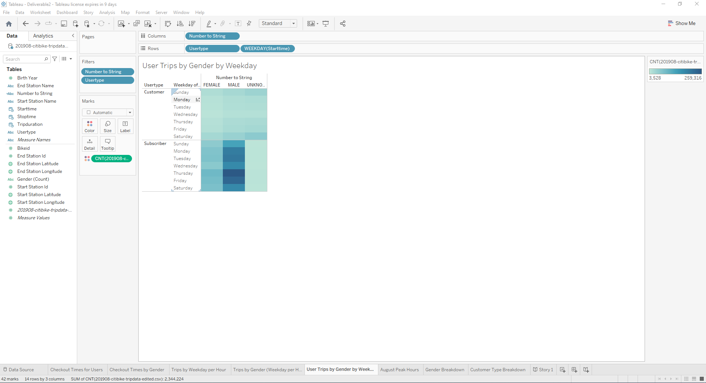
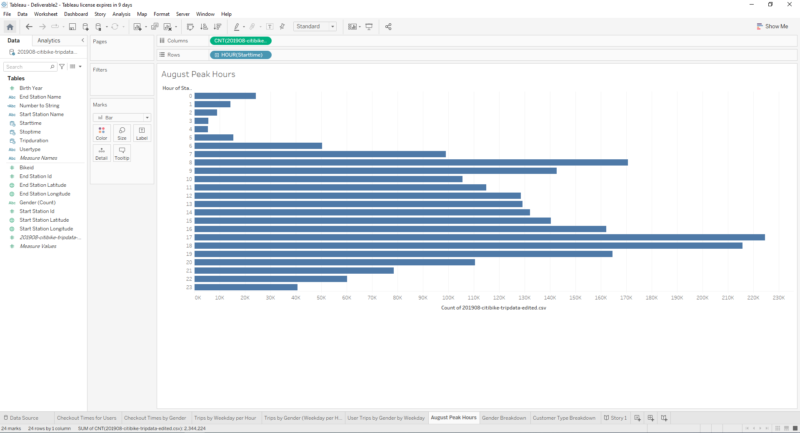
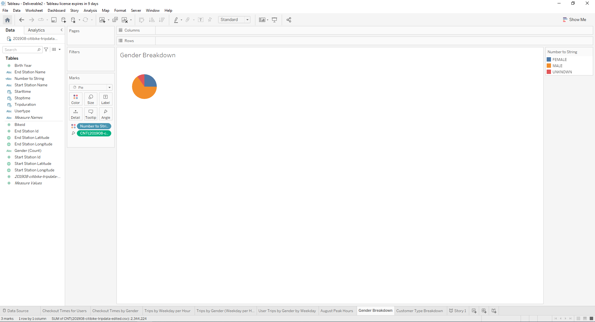
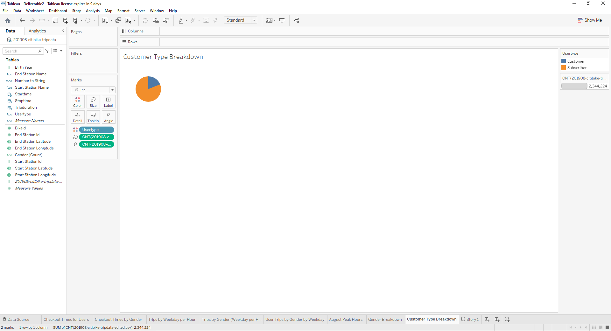

# NY Citibike with Tableau

### Overview of the Analysis

The purpose of this analysis was to:

1. Use Pandas to change the "tripduration" column from an integer to a datetime datatype
2. Show the length of time that bikes are checked out for all riders and genders 
3. Show the number of bike trips for all riders and genders for each hour of each day of the week
4. Show the number of bike trips for each type of user and gender for each day of the week. 
5. Add the new visualizations to the ones created in the module

To do that, we had to:

1. Change Trip Duration to a Datetime Format
2. Create Visualizations for the Trip Analysis
3. Create a Story and Report for the Final Presentation

### Results

[link to dashboard](https://public.tableau.com/views/Deliverable2_16510871584180/Story1?:language=en-US&:display_count=n&:origin=viz_share_link)

We were able to:
1. The highest count occurs at the 5 minute mark for all genders.

2. The highest count occurs at the 5 minute mark for males, 6 minute mark for females, and 11 minute mark for unknown.

3. Trips are most commonly taken at 8am or after 5pm on Thursdays.

4. Trips are most commonly taken at 8am or after 5pm, but more of the riders are males than females.

5. A large majority of the usertypes are male subscribers.

6. Peak hours for usage are 8am and after 5pm.

7. 225k users are female, 588k users are unknown gender, and 1.5m users are male.

8. 443k users are not subscribers and 1.9m users are subscribers.

### Summary

Overall, after looking at this visualization that we have created, we can tell that:

1. A large majority of the customer base are males.

2. A large majority of the customer base are subscribers or those who bike regularly.

3. A large majority of the trips are taken either before or after work.

4. Two addition visualizations I would suggest are finding the hotspots in the city where people like to congregate and finding the downtime to do bike maintenance.

